# 🏗️ Sports Booking System - Class Diagram (Based on Actual Code)

**Class Diagram ที่ตรงกับ Model classes ที่เขียนจริง**

---

## 📋 **PlantUML Code - Actual Implementation**

```plantuml
@startuml SportsBookingDetailedClassDiagram
!theme plain
skinparam linetype ortho
skinparam classAttributeIconSize 0

' ===================================
' User Class - ผู้ใช้งานระบบ (Customer + Admin)
' ===================================
class User {
    ' Attributes with Length, Keys
    - id : int {PK} <<auto_increment>>
    - username : String(50) {CK} <<unique>>
    - email : String(100) {CK} <<unique>>
    - phone : String(20)
    - firstName : String(100) <<not null>>
    - lastName : String(100) <<not null>>
    - password : String(255) <<not null>>
    - isAdmin : boolean <<default: false>>
    - createdAt : Timestamp <<default: CURRENT_TIMESTAMP>>
    - updatedAt : Timestamp <<on update>>
    ..
    ' Getter Methods
    + getId() : int
    + getUsername() : String
    + getEmail() : String
    + getPhone() : String
    + getFirstName() : String
    + getLastName() : String
    + getPassword() : String
    + getIsAdmin() : boolean
    + isAdmin() : boolean
    ..
    ' Setter Methods
    + setId(id : int) : void
    + setUsername(username : String) : void
    + setEmail(email : String) : void
    + setPhone(phone : String) : void
    + setFirstName(firstName : String) : void
    + setLastName(lastName : String) : void
    + setPassword(password : String) : void
    + setAdmin(isAdmin : boolean) : void
    + setIsAdmin(isAdmin : boolean) : void
    ..
    ' Business Methods
    + getFullName() : String
    + isValid() : boolean
    + toString() : String
    + validateUsername() : boolean
    + validateEmail() : boolean
    + validatePassword() : boolean
    + hasAdminPrivileges() : boolean
}

' ===================================
' Field Class - สนามกีฬา
' ===================================
class Field {
    ' Attributes with Length, Keys
    - id : int {PK} <<auto_increment>>
    - fieldType : String(50) <<not null>>
    - name : String(100) {CK} <<unique>>
    - description : Text(2000)
    - price : double(10,2) <<not null>>
    - location : String(200)
    - imageUrl : String(500)
    - status : String(20) <<default: "available">>
    - capacity : int <<default: 0>>
    - operatingHours : String(50)
    - createdAt : Timestamp <<default: CURRENT_TIMESTAMP>>
    - updatedAt : Timestamp <<on update>>
    ..
    ' Getter Methods
    + getId() : int
    + getFieldType() : String
    + getName() : String
    + getDescription() : String
    + getPrice() : double
    + getLocation() : String
    + getImageUrl() : String
    + getStatus() : String
    + getCapacity() : int
    + getOperatingHours() : String
    ..
    ' Setter Methods
    + setId(id : int) : void
    + setFieldType(fieldType : String) : void
    + setName(name : String) : void
    + setDescription(description : String) : void
    + setPrice(price : double) : void
    + setLocation(location : String) : void
    + setImageUrl(imageUrl : String) : void
    + setStatus(status : String) : void
    + setCapacity(capacity : int) : void
    + setOperatingHours(operatingHours : String) : void
    ..
    ' Business Methods
    + isAvailable() : boolean
    + checkAvailability(date : Date, startTime : Time, endTime : Time) : boolean
    + calculatePrice(hours : int) : double
    + updateStatus(status : String) : void
    + isActive() : boolean
    + toString() : String
}

' ===================================
' Booking Class - การจองสนาม
' ===================================
class Booking {
    ' Attributes with Length, Keys
    - bookingId : int {PK} <<auto_increment>>
    - userId : int {FK} <<references User(id)>>
    - bookingDate : Date <<not null>>
    - startTime : Time <<not null>>
    - endTime : Time <<not null>>
    - status : String(20) <<default: "pending">>
    - fieldType : String(50) <<not null>>
    - totalPrice : int <<not null>>
    - createdAt : Timestamp <<default: CURRENT_TIMESTAMP>>
    - paymentStatus : String(20) <<default: "unpaid">>
    - updatedAt : Timestamp <<on update>>
    ..
    ' Getter Methods
    + getBookingId() : int
    + getUserId() : int
    + getBookingDate() : Date
    + getStartTime() : Time
    + getEndTime() : Time
    + getStatus() : String
    + getFieldType() : String
    + getTotalPrice() : int
    + getCreatedAt() : Timestamp
    + getPaymentStatus() : String
    ..
    ' Setter Methods
    + setBookingId(bookingId : int) : void
    + setUserId(userId : int) : void
    + setBookingDate(bookingDate : Date) : void
    + setStartTime(startTime : Time) : void
    + setEndTime(endTime : Time) : void
    + setStatus(status : String) : void
    + setFieldType(fieldType : String) : void
    + setTotalPrice(totalPrice : int) : void
    + setCreatedAt(createdAt : Timestamp) : void
    + setPaymentStatus(paymentStatus : String) : void
    ..
    ' Business Methods
    + calculateDuration() : int
    + validateBookingTime() : boolean
    + isOverlapping(otherBooking : Booking) : boolean
    + isPending() : boolean
    + isConfirmed() : boolean
    + isCancelled() : boolean
    + isPaid() : boolean
    + cancel() : boolean
    + confirm() : boolean
    + toString() : String
}

' ===================================
' Payment Class - การชำระเงิน
' ===================================
class Payment {
    ' Attributes with Length, Keys
    - paymentId : int {PK} <<auto_increment>>
    - bookingId : int {FK} <<references Booking(bookingId)>>
    - amount : double(10,2) <<not null>>
    - paymentMethod : String(30) <<not null>>
    - transactionId : String(100) {CK} <<unique>>
    - paymentStatus : String(20) <<default: "pending">>
    - paymentDate : Timestamp <<default: CURRENT_TIMESTAMP>>
    - createdAt : Timestamp <<default: CURRENT_TIMESTAMP>>
    - updatedAt : Timestamp <<on update>>
    ..
    ' Getter Methods
    + getPaymentId() : int
    + getBookingId() : int
    + getAmount() : double
    + getPaymentMethod() : String
    + getTransactionId() : String
    + getPaymentStatus() : String
    + getPaymentDate() : Timestamp
    ..
    ' Setter Methods
    + setPaymentId(paymentId : int) : void
    + setBookingId(bookingId : int) : void
    + setAmount(amount : double) : void
    + setPaymentMethod(paymentMethod : String) : void
    + setTransactionId(transactionId : String) : void
    + setPaymentStatus(paymentStatus : String) : void
    + setPaymentDate(paymentDate : Timestamp) : void
    ..
    ' Business Methods
    + processPayment() : boolean
    + verifyPayment() : boolean
    + isPending() : boolean
    + isCompleted() : boolean
    + isFailed() : boolean
    + refund() : boolean
    + generateTransactionId() : String
    + validateAmount() : boolean
    + toString() : String
}

' =========== RELATIONSHIPS WITH MULTIPLICITY ===========

' User to Booking Relationship (One User can make Many Bookings)
User "1" --o{ "0..*" Booking : makes >
Booking }o-- User : belongs to

' Booking to Payment Relationship (One Booking can have One Payment)
Booking "1" --o| "0..1" Payment : has >
Payment |o-- Booking : for

' =========== FOREIGN KEY LINKS ===========
User ||..|| Booking : userId {FK}
Booking ||..|| Payment : bookingId {FK}

' =========== NOTES & CONSTRAINTS ===========

note right of User
  **User Role Management:**
  • isAdmin = true → System Administrator
  • isAdmin = false → Regular Customer
  
  **Constraints:**
  • username: 4-50 characters, unique
  • email: valid email format, unique
  • password: minimum 8 characters
  • firstName & lastName: required
  
  **Default Behavior:**
  • New users are customers by default
  • Timestamps auto-managed
end note

note right of Field
  **Field Status Values:**
  • "available" - พร้อมให้บริการ
  • "maintenance" - ปิดซ่อมบำรุง
  • "reserved" - จองแล้ว
  • "inactive" - ปิดใช้งาน
  
  **Constraints:**
  • name: unique field name
  • price: must be > 0
  • capacity: integer >= 0
  
  **Business Rules:**
  • Operating hours format: "HH:MM-HH:MM"
  • Image URL can store multiple images (comma-separated)
end note

note right of Booking
  **Booking Status Values:**
  • "pending" - รอการยืนยัน
  • "confirmed" - ยืนยันแล้ว
  • "cancelled" - ยกเลิก
  • "completed" - เสร็จสิ้น
  
  **Payment Status Values:**
  • "unpaid" - ยังไม่จ่าย
  • "paid" - จ่ายแล้ว
  • "refunded" - คืนเงินแล้ว
  
  **Constraints:**
  • endTime must be after startTime
  • bookingDate cannot be in the past
  • totalPrice must be > 0
  
  **Note:**
  • fieldType references Field.fieldType
  • No direct FK constraint to Field table
end note

note right of Payment
  **Payment Method Values:**
  • "qrCode" - QR Code Payment
  • "bankTransfer" - Bank Transfer
  • "creditCard" - Credit Card
  • "cash" - Cash Payment
  
  **Payment Status Values:**
  • "pending" - รอการชำระเงิน
  • "completed" - ชำระเงินสำเร็จ
  • "failed" - ชำระเงินล้มเหลว
  • "refunded" - คืนเงินแล้ว
  
  **Constraints:**
  • transactionId: unique identifier
  • amount must match Booking.totalPrice
  • paymentMethod is required
  
  **Business Rules:**
  • Transaction ID generated from payment gateway
  • Payment date auto-set on successful payment
end note

@enduml
```



---

## 📊 **Detailed Database Schema**

### **Table: users**
| Column | Data Type | Length | Constraint | Description |
|--------|-----------|--------|------------|-------------|
| **id** | INT | - | PK, AUTO_INCREMENT | รหัสผู้ใช้งาน |
| **username** | VARCHAR | 50 | UNIQUE, NOT NULL | ชื่อผู้ใช้งาน (CK) |
| **email** | VARCHAR | 100 | UNIQUE, NOT NULL | อีเมล (CK) |
| **phone** | VARCHAR | 20 | - | เบอร์โทรศัพท์ |
| **firstName** | VARCHAR | 100 | NOT NULL | ชื่อจริง |
| **lastName** | VARCHAR | 100 | NOT NULL | นามสกุล |
| **password** | VARCHAR | 255 | NOT NULL | รหัสผ่าน (hashed) |
| **isAdmin** | BOOLEAN | - | DEFAULT FALSE | สถานะผู้ดูแลระบบ |
| **createdAt** | TIMESTAMP | - | DEFAULT CURRENT_TIMESTAMP | วันที่สร้าง |
| **updatedAt** | TIMESTAMP | - | ON UPDATE CURRENT_TIMESTAMP | วันที่อัปเดต |

**Indexes:**
- PRIMARY KEY: `id`
- UNIQUE KEY: `username`, `email`

**Business Rules:**
- `username`: ความยาว 4-50 ตัวอักษร, ต้องไม่ซ้ำ
- `email`: รูปแบบอีเมลที่ถูกต้อง, ต้องไม่ซ้ำ
- `password`: ความยาวขั้นต่ำ 8 ตัวอักษร
- `isAdmin = TRUE`: ผู้ดูแลระบบ, `FALSE`: ลูกค้า

---

### **Table: fields**
| Column | Data Type | Length | Constraint | Description |
|--------|-----------|--------|------------|-------------|
| **id** | INT | - | PK, AUTO_INCREMENT | รหัสสนาม |
| **fieldType** | VARCHAR | 50 | NOT NULL | ประเภทสนาม |
| **name** | VARCHAR | 100 | UNIQUE, NOT NULL | ชื่อสนาม (CK) |
| **description** | TEXT | 2000 | - | คำอธิบาย |
| **price** | DECIMAL | 10,2 | NOT NULL | ราคาต่อชั่วโมง |
| **location** | VARCHAR | 200 | - | ที่ตั้ง |
| **imageUrl** | VARCHAR | 500 | - | URL รูปภาพ |
| **status** | VARCHAR | 20 | DEFAULT 'available' | สถานะ |
| **capacity** | INT | - | DEFAULT 0 | จำนวนที่รองรับ |
| **operatingHours** | VARCHAR | 50 | - | เวลาทำการ |
| **createdAt** | TIMESTAMP | - | DEFAULT CURRENT_TIMESTAMP | วันที่สร้าง |
| **updatedAt** | TIMESTAMP | - | ON UPDATE CURRENT_TIMESTAMP | วันที่อัปเดต |

**Indexes:**
- PRIMARY KEY: `id`
- UNIQUE KEY: `name`

**Status Values:**
- `available`: พร้อมให้บริการ
- `maintenance`: ปิดซ่อมบำรุง
- `reserved`: จองแล้ว
- `inactive`: ปิดใช้งาน

**Business Rules:**
- `price` > 0
- `operatingHours` format: "HH:MM-HH:MM"

---

### **Table: bookings**
| Column | Data Type | Length | Constraint | Description |
|--------|-----------|--------|------------|-------------|
| **bookingId** | INT | - | PK, AUTO_INCREMENT | รหัสการจอง |
| **userId** | INT | - | FK → users(id), NOT NULL | รหัสผู้ใช้งาน |
| **bookingDate** | DATE | - | NOT NULL | วันที่จอง |
| **startTime** | TIME | - | NOT NULL | เวลาเริ่มต้น |
| **endTime** | TIME | - | NOT NULL | เวลาสิ้นสุด |
| **status** | VARCHAR | 20 | DEFAULT 'pending' | สถานะการจอง |
| **fieldType** | VARCHAR | 50 | NOT NULL | ประเภทสนาม |
| **totalPrice** | INT | - | NOT NULL | ราคารวม (บาท) |
| **createdAt** | TIMESTAMP | - | DEFAULT CURRENT_TIMESTAMP | วันที่สร้าง |
| **paymentStatus** | VARCHAR | 20 | DEFAULT 'unpaid' | สถานะการชำระเงิน |
| **updatedAt** | TIMESTAMP | - | ON UPDATE CURRENT_TIMESTAMP | วันที่อัปเดต |

**Indexes:**
- PRIMARY KEY: `bookingId`
- FOREIGN KEY: `userId` REFERENCES `users(id)` ON DELETE CASCADE

**Status Values:**
- `pending`: รอการยืนยัน
- `confirmed`: ยืนยันแล้ว
- `cancelled`: ยกเลิก
- `completed`: เสร็จสิ้น

**Payment Status Values:**
- `unpaid`: ยังไม่จ่าย
- `paid`: จ่ายแล้ว
- `refunded`: คืนเงินแล้ว

**Business Rules:**
- `endTime` > `startTime`
- `bookingDate` >= CURRENT_DATE
- `totalPrice` > 0
- `fieldType` อ้างอิงถึง `fields.fieldType` (ไม่มี FK constraint)

---

### **Table: payments**
| Column | Data Type | Length | Constraint | Description |
|--------|-----------|--------|------------|-------------|
| **paymentId** | INT | - | PK, AUTO_INCREMENT | รหัสการชำระเงิน |
| **bookingId** | INT | - | FK → bookings(bookingId), NOT NULL | รหัสการจอง |
| **amount** | DECIMAL | 10,2 | NOT NULL | จำนวนเงิน |
| **paymentMethod** | VARCHAR | 30 | NOT NULL | วิธีการชำระเงิน |
| **transactionId** | VARCHAR | 100 | UNIQUE | รหัสธุรกรรม (CK) |
| **paymentStatus** | VARCHAR | 20 | DEFAULT 'pending' | สถานะการชำระเงิน |
| **paymentDate** | TIMESTAMP | - | DEFAULT CURRENT_TIMESTAMP | วันที่ชำระเงิน |
| **createdAt** | TIMESTAMP | - | DEFAULT CURRENT_TIMESTAMP | วันที่สร้าง |
| **updatedAt** | TIMESTAMP | - | ON UPDATE CURRENT_TIMESTAMP | วันที่อัปเดต |

**Indexes:**
- PRIMARY KEY: `paymentId`
- FOREIGN KEY: `bookingId` REFERENCES `bookings(bookingId)` ON DELETE CASCADE
- UNIQUE KEY: `transactionId`

**Payment Method Values:**
- `qrCode`: QR Code Payment
- `bankTransfer`: Bank Transfer
- `creditCard`: Credit Card
- `cash`: Cash Payment

**Payment Status Values:**
- `pending`: รอการชำระเงิน
- `completed`: ชำระเงินสำเร็จ
- `failed`: ชำระเงินล้มเหลว
- `refunded`: คืนเงินแล้ว

**Business Rules:**
- `amount` ต้องตรงกับ `bookings.totalPrice`
- `transactionId` generate จาก payment gateway (unique)
- `paymentDate` auto-set เมื่อ status = 'completed'

---

## � **Relationships & Multiplicity**

### **1. User → Booking (One-to-Many)**
```
User (1) ────makes───▶ Booking (0..*)
```
- **Cardinality:** หนึ่ง User สามารถทำการจองได้หลายครั้ง
- **Foreign Key:** `bookings.userId` → `users.id`
- **Delete Rule:** CASCADE (ลบ User จะลบ Bookings ทั้งหมด)
- **Business Rule:** User ต้องมีอยู่ก่อนจึงจะจองได้

**SQL Constraint:**
```sql
ALTER TABLE bookings 
ADD CONSTRAINT fk_booking_user 
FOREIGN KEY (userId) REFERENCES users(id) 
ON DELETE CASCADE ON UPDATE CASCADE;
```

---

### **2. Booking → Payment (One-to-One/Zero)**
```
Booking (1) ────has───▶ Payment (0..1)
```
- **Cardinality:** หนึ่ง Booking มี 0 หรือ 1 Payment
- **Foreign Key:** `payments.bookingId` → `bookings.bookingId`
- **Delete Rule:** CASCADE (ลบ Booking จะลบ Payment)
- **Business Rule:** Payment สร้างได้เมื่อ Booking ถูกยืนยันแล้ว

**SQL Constraint:**
```sql
ALTER TABLE payments 
ADD CONSTRAINT fk_payment_booking 
FOREIGN KEY (bookingId) REFERENCES bookings(bookingId) 
ON DELETE CASCADE ON UPDATE CASCADE;
```

---

### **3. Field ↔ Booking (Loose Reference)**
```
Field ······references······ Booking
      (fieldType)    (fieldType)
```
- **Cardinality:** ไม่มีความสัมพันธ์แบบ FK โดยตรง
- **Reference:** `bookings.fieldType` อ้างอิงไปยัง `fields.fieldType` (String)
- **Business Rule:** ตรวจสอบว่า fieldType มีอยู่ใน fields ก่อนสร้าง booking
- **Note:** ไม่มี CASCADE delete behavior

**ควรปรับปรุงในอนาคต:**
```sql
-- เพิ่ม field_id ใน bookings
ALTER TABLE bookings ADD COLUMN field_id INT;
ALTER TABLE bookings 
ADD CONSTRAINT fk_booking_field 
FOREIGN KEY (field_id) REFERENCES fields(id);
```

---

## 🔑 **Keys Summary**

### **Primary Keys (PK)**
| Table | Primary Key | Type | Auto Increment |
|-------|-------------|------|----------------|
| users | id | INT | ✅ |
| fields | id | INT | ✅ |
| bookings | bookingId | INT | ✅ |
| payments | paymentId | INT | ✅ |

### **Foreign Keys (FK)**
| Child Table | FK Column | Parent Table | Parent Column | On Delete | On Update |
|-------------|-----------|--------------|---------------|-----------|-----------|
| bookings | userId | users | id | CASCADE | CASCADE |
| payments | bookingId | bookings | bookingId | CASCADE | CASCADE |

### **Candidate Keys (CK) - Unique Constraints**
| Table | Column | Purpose | Example |
|-------|--------|---------|---------|
| users | username | ชื่อผู้ใช้ไม่ซ้ำ | "narathip1707" |
| users | email | อีเมลไม่ซ้ำ | "user@example.com" |
| fields | name | ชื่อสนามไม่ซ้ำ | "Barcelona Stadium 1" |
| payments | transactionId | รหัสธุรกรรมไม่ซ้ำ | "TXN_20250105_001234" |

---

## 📐 **Entity Relationship Diagram (ERD Style)**

```
┌─────────────────────────────────┐
│           users                 │
│─────────────────────────────────│
│ 🔑 id (PK)                      │
│ 🔒 username (UK)                │
│ 🔒 email (UK)                   │
│    phone                        │
│    firstName                    │
│    lastName                     │
│    password                     │
│    isAdmin                      │
│    createdAt                    │
│    updatedAt                    │
└─────────┬───────────────────────┘
          │ 1
          │ makes
          │
          │ 0..*
┌─────────▼───────────────────────┐
│         bookings                │
│─────────────────────────────────│
│ 🔑 bookingId (PK)               │
│ 🔗 userId (FK → users)          │
│    bookingDate                  │
│    startTime                    │
│    endTime                      │
│    status                       │
│    fieldType                    │
│    totalPrice                   │
│    createdAt                    │
│    paymentStatus                │
│    updatedAt                    │
└─────────┬───────────────────────┘
          │ 1
          │ has
          │
          │ 0..1
┌─────────▼───────────────────────┐
│         payments                │
│─────────────────────────────────│
│ 🔑 paymentId (PK)               │
│ 🔗 bookingId (FK → bookings)    │
│    amount                       │
│    paymentMethod                │
│ 🔒 transactionId (UK)           │
│    paymentStatus                │
│    paymentDate                  │
│    createdAt                    │
│    updatedAt                    │
└─────────────────────────────────┘

┌─────────────────────────────────┐
│           fields                │
│─────────────────────────────────│
│ 🔑 id (PK)                      │
│    fieldType                    │
│ 🔒 name (UK)                    │
│    description                  │
│    price                        │
│    location                     │
│    imageUrl                     │
│    status                       │
│    capacity                     │
│    operatingHours               │
│    createdAt                    │
│    updatedAt                    │
└─────────────────────────────────┘
          ┊ (loose reference)
          ┊ fieldType
          ┊
   ┌──────┴──────┐
   │   bookings  │
   └─────────────┘

Legend:
🔑 = Primary Key
🔗 = Foreign Key  
🔒 = Unique Constraint (Candidate Key)
```

---

## 🎯 **Business Logic & Validation Rules**

### **User Validation**
```java
public boolean isValid() {
    // Username: 4-50 characters, unique
    if (username == null || username.trim().isEmpty() || 
        username.length() < 4 || username.length() > 50) {
        return false;
    }
    
    // Email: valid format, unique
    if (email == null || !email.matches("[a-zA-Z0-9._%+-]+@[a-zA-Z0-9.-]+\\.[a-zA-Z]{2,}")) {
        return false;
    }
    
    // Password: minimum 8 characters
    if (password == null || password.length() < 8) {
        return false;
    }
    
    return true;
}
```

### **Booking Validation**
```java
public boolean validateBookingTime() {
    // Check if endTime is after startTime
    if (endTime.before(startTime)) {
        return false;
    }
    
    // Check if booking date is not in the past
    if (bookingDate.before(new Date())) {
        return false;
    }
    
    // Check if totalPrice is positive
    if (totalPrice <= 0) {
        return false;
    }
    
    return true;
}

public boolean isOverlapping(Booking other) {
    // Check if two bookings overlap in time
    return this.bookingDate.equals(other.bookingDate) &&
           this.fieldType.equals(other.fieldType) &&
           !(this.endTime.before(other.startTime) || 
             this.startTime.after(other.endTime));
}
```

### **Payment Validation**
```java
public boolean validateAmount() {
    // Payment amount must match booking total price
    Booking booking = getBookingById(this.bookingId);
    return this.amount == booking.getTotalPrice();
}

public String generateTransactionId() {
    // Format: TXN_YYYYMMDD_HHMMSS_RANDOM
    SimpleDateFormat sdf = new SimpleDateFormat("yyyyMMdd_HHmmss");
    String timestamp = sdf.format(new Date());
    String random = String.format("%06d", new Random().nextInt(1000000));
    return "TXN_" + timestamp + "_" + random;
}
```

---

## 🔄 **State Transitions**

### **Booking Status Flow**
```
    [New Booking]
         │
         ▼
    ┌─────────┐
    │ pending │ ◄─── Initial state
    └────┬────┘
         │
    ┌────┴─────┬─────────┐
    ▼          ▼         ▼
confirmed  cancelled  expired
    │
    ▼
completed
```

**Valid Transitions:**
- `pending → confirmed` (when admin approves)
- `pending → cancelled` (user cancels)
- `pending → expired` (timeout)
- `confirmed → cancelled` (admin cancels)
- `confirmed → completed` (after booking date)

### **Payment Status Flow**
```
    [New Payment]
         │
         ▼
    ┌─────────┐
    │ pending │ ◄─── Initial state
    └────┬────┘
         │
    ┌────┴────┬─────────┐
    ▼         ▼         ▼
completed  failed   refunded
```

**Valid Transitions:**
- `pending → completed` (successful payment)
- `pending → failed` (payment error)
- `completed → refunded` (refund request)

---

## 🔍 **Implementation Notes**

### **🎯 Current Implementation (ตามโค้ดจริง)**
- ✅ มี 4 Model Classes: `User`, `Field`, `Booking`, `Payment`
- ✅ User ใช้ `isAdmin` flag แทนการแยก Customer/Admin classes
- ✅ Booking มี FK ไป User (`userId`)
- ✅ Payment มี FK ไป Booking (`bookingId`)
- ✅ Field เป็น standalone (ยังไม่มี FK relationship กับ Booking)

### **⚠️ ความแตกต่างจาก Complete Class Diagram**

| Feature | Complete Design | Actual Implementation |
|---------|----------------|----------------------|
| **User Hierarchy** | Person → Customer/Employee | User (with isAdmin flag) |
| **Employee Types** | BookingStaff, SystemAdmin, AccountingStaff, etc. | ❌ ไม่มี |
| **Field Relationship** | Booking.field_id → Field.id (FK) | Booking.fieldType → Field.fieldType (String reference) |
| **Services** | Service, BookingDetail classes | ❌ ไม่มี |
| **External Integration** | PaymentGateway, Logistic, Invoice | ❌ ไม่มี (มีแค่ Payment) |
| **Account Management** | Separate Account class | ❌ รวมใน User class |

### **💡 แนะนำการปรับปรุง (Future Enhancements)**

#### **1. เพิ่ม Field FK Constraint**
```sql
-- Step 1: Add field_id column
ALTER TABLE bookings ADD COLUMN field_id INT AFTER userId;

-- Step 2: Migrate data
UPDATE bookings b 
JOIN fields f ON b.fieldType = f.fieldType 
SET b.field_id = f.id;

-- Step 3: Add FK constraint
ALTER TABLE bookings 
ADD CONSTRAINT fk_booking_field 
FOREIGN KEY (field_id) REFERENCES fields(id)
ON DELETE RESTRICT ON UPDATE CASCADE;

-- Step 4: Keep fieldType for backward compatibility
-- หรือ DROP column ถ้าไม่ต้องการใช้แล้ว
```

#### **2. แยก Customer และ Admin Classes**
```java
// Base User class
public abstract class User {
    protected int id;
    protected String username;
    protected String email;
    // ... common fields
}

// Customer extends User
public class Customer extends User {
    private int loyaltyPoints;
    private String membershipLevel;
    private Date registrationDate;
    
    public void makeBooking() { /* ... */ }
    public void viewHistory() { /* ... */ }
}

// Admin extends User
public class Admin extends User {
    private String department;
    private int accessLevel;
    
    public void manageUsers() { /* ... */ }
    public void approveBooking() { /* ... */ }
}
```

#### **3. เพิ่ม Service และ BookingDetail**
```java
public class Service {
    private int serviceId;
    private int fieldId; // FK to Field
    private String serviceName;
    private double servicePrice;
    // ... other fields
}

public class BookingDetail {
    private int detailId;
    private int bookingId; // FK to Booking
    private int serviceId; // FK to Service
    private int quantity;
    private double unitPrice;
    private double subtotal;
}
```

#### **4. เพิ่ม Payment Gateway Integration**
```java
public class PaymentGateway {
    private int gatewayId;
    private String gatewayName; // "PromptPay", "SCB", "KBank"
    private String apiEndpoint;
    private String apiKey;
    private boolean isActive;
    
    public String initializePayment(Payment payment) { /* ... */ }
    public boolean confirmPayment(String transactionId) { /* ... */ }
}
```

---

## 📁 **ไฟล์ที่มีอยู่จริงในโปรเจค**

```
✅ มีอยู่แล้ว:
src/java/model/
├── User.java           ✅ (id, username, email, password, isAdmin, ...)
├── Field.java          ✅ (id, fieldType, name, price, status, ...)
├── Booking.java        ✅ (bookingId, userId, bookingDate, totalPrice, ...)
└── Payment.java        ✅ (paymentId, bookingId, amount, paymentStatus, ...)

❌ ยังไม่มี (แนะนำให้เพิ่มในอนาคต):
├── Person.java         ❌ (Abstract base class)
├── Customer.java       ❌ (extends User)
├── Employee.java       ❌ (extends User)
├── Admin.java          ❌ (extends Employee)
├── Service.java        ❌ (Additional services for fields)
├── BookingDetail.java  ❌ (Many-to-many: Booking ↔ Service)
├── PaymentGateway.java ❌ (Payment gateway integration)
├── Invoice.java        ❌ (Financial records)
└── Logistic.java       ❌ (Delivery management)
```

---

## 🚀 **Quick Start - วาด Class Diagram ใน Draw.io**

### **Step 1: เตรียม Draw.io**
1. เปิด https://app.diagrams.net/
2. เลือก "Blank Diagram"
3. เปิด Shape Library: More Shapes → Software → UML

### **Step 2: สร้าง Classes (4 classes)**
สำหรับแต่ละ class:
1. ลาก "Class" shape มาวาง
2. กด Double-click แก้ไขชื่อ class
3. เพิ่ม Attributes (ดูจาก PlantUML code ด้านบน)
4. เพิ่ม Methods (ดูจาก PlantUML code ด้านบน)

### **Step 3: วาดความสัมพันธ์**
1. **User → Booking:** 
   - ใช้ Association arrow (solid line with arrow)
   - Label: "makes"
   - Multiplicity: "1" ที่ User, "0..*" ที่ Booking

2. **Booking → Payment:**
   - ใช้ Association arrow
   - Label: "has"
   - Multiplicity: "1" ที่ Booking, "0..1" ที่ Payment

3. **FK Links:**
   - ใช้ Dependency arrow (dashed line)
   - User ┄┄┄▶ Booking (userId)
   - Booking ┄┄┄▶ Payment (bookingId)

### **Step 4: จัด Layout**
```
┌─────────┐                    ┌─────────┐
│  User   │                    │  Field  │
└────┬────┘                    └─────────┘
     │ 1
     │ makes
     │ 0..*
     ▼
┌──────────┐
│ Booking  │
└────┬─────┘
     │ 1
     │ has
     │ 0..1
     ▼
┌──────────┐
│ Payment  │
└──────────┘
```

### **Step 5: เพิ่มรายละเอียด**
- ใส่ stereotype: `<<PK>>`, `<<FK>>`, `<<UK>>`
- ใส่ data types: `int`, `String(50)`, `Date`, `Timestamp`
- ใส่ access modifiers: `-` (private), `+` (public)

### **Step 6: Export**
- File → Export as → PNG (สำหรับเอกสาร)
- File → Export as → PDF (สำหรับนำเสนอ)
- File → Save (XML format สำหรับแก้ไขภายหลัง)

---

## ⏱️ **เวลาโดยประมาณ**

| Task | Time | Difficulty |
|------|------|-----------|
| วาด 4 classes พร้อม attributes | 30-45 นาที | ⭐⭐ |
| เพิ่ม methods ทั้งหมด | 20-30 นาที | ⭐⭐ |
| วาดความสัมพันธ์และ FK links | 15-20 นาที | ⭐⭐ |
| จัด layout และตกแต่ง | 15-20 นาที | ⭐ |
| เพิ่ม notes และ constraints | 10-15 นาที | ⭐ |
| **รวมทั้งหมด** | **1.5-2 ชั่วโมง** | ⭐⭐ |

---

## ✅ **Checklist สำหรับ Class Diagram**

### **Classes (4 classes)**
- [ ] User class (complete with all attributes + methods)
- [ ] Field class (complete with all attributes + methods)  
- [ ] Booking class (complete with all attributes + methods)
- [ ] Payment class (complete with all attributes + methods)

### **Attributes**
- [ ] ทุก attribute มี data type + length
- [ ] ทุก PK มี `{PK}` marker
- [ ] ทุก FK มี `{FK}` marker
- [ ] Candidate keys มี `{CK}` marker
- [ ] มี access modifiers (- for private)

### **Methods**
- [ ] Getter methods สำหรับทุก attribute
- [ ] Setter methods สำหรับทุก attribute
- [ ] Business methods (getFullName, isValid, calculateDuration, etc.)
- [ ] มี return types และ parameters ครบ

### **Relationships**
- [ ] User → Booking (1 to 0..*)
- [ ] Booking → Payment (1 to 0..1)
- [ ] ใส่ multiplicity ครบ
- [ ] ใส่ relationship names (makes, has)

### **FK Links**
- [ ] User ┄▶ Booking (userId)
- [ ] Booking ┄▶ Payment (bookingId)
- [ ] ใช้ dashed lines

### **Notes & Documentation**
- [ ] เพิ่ม notes อธิบาย status values
- [ ] เพิ่ม constraints และ business rules
- [ ] เพิ่ม legend อธิบาย symbols

---

## 🎓 **Tips สำหรับการวาด**

1. **เริ่มจาก User class** (เป็น root ของระบบ)
2. **วาด Booking ต่อจาก User** (main entity)
3. **วาด Payment ต่อจาก Booking** (dependent entity)
4. **วาง Field แยกต่างหาก** (standalone)
5. **เชื่อมความสัมพันธ์หลังสุด**
6. **ใส่รายละเอียดเป็นขั้นสุดท้าย**

**ใช้ PlantUML code ด้านบนเป็น reference ได้เลยครับ!** �