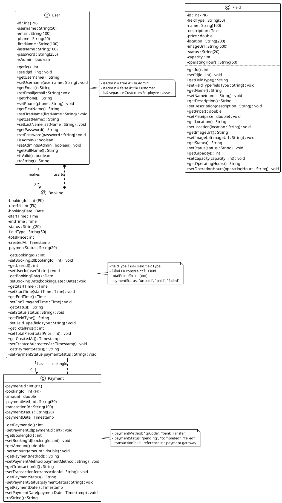

# 🏗️ Sports Booking System - Class Diagram (Based on Actual Code)

**Class Diagram ที่ตรงกับ Model classes ที่เขียนจริง**

---

## 📋 **PlantUML Code - Actual Implementation**



---

## 📊 **Actual Database Schema**

| Table | Primary Key | Foreign Keys | Actual Columns |
|-------|------------|--------------|----------------|
| **users** | id (int) | - | id, username, email, phone, firstName, lastName, password, isAdmin |
| **fields** | id (int) | - | id, fieldType, name, description, price, location, imageUrl, status, capacity, operatingHours |
| **bookings** | bookingId (int) | userId → users.id | bookingId, userId, bookingDate, startTime, endTime, status, fieldType, totalPrice, createdAt, paymentStatus |
| **payments** | paymentId (int) | bookingId → bookings.bookingId | paymentId, bookingId, amount, paymentMethod, transactionId, paymentStatus, paymentDate |

---

## 🔍 **ความแตกต่างจาก Design เดิม:**

### **1. ไม่มี Person Abstract Class:**
```
❌ Design เดิม: Person → Customer/Employee
✅ โค้ดจริง: User class เดียว (แยกด้วย isAdmin flag)
```

### **2. ไม่มี Employee Hierarchy:**
```
❌ Design เดิม: Employee → BookingStaff/SystemAdmin/AccountingStaff
✅ โค้ดจริง: ไม่มี Employee classes แยก
```

### **3. Booking ไม่มี FK ไป Field:**
```
❌ Design เดิม: Booking.field_id → Field.field_id
✅ โค้ดจริง: Booking.fieldType (String) - reference โดยไม่มี FK
```

### **4. ไม่มี Service, BookingDetail:**
```
❌ Design เดิม: มี Service และ BookingDetail classes
✅ โค้ดจริง: ไม่มี classes เหล่านี้
```

### **5. ไม่มี External Services:**
```
❌ Design เดิม: มี PaymentGateway, Logistic, Invoice classes
✅ โค้ดจริง: มีแค่ Payment class (ไม่มี Gateway/Logistic/Invoice แยก)
```

---

## 🎯 **Simplified Class Diagram (ตามโค้ดจริง):**

```
┌─────────────┐
│    User     │
│  (isAdmin)  │
└──────┬──────┘
       │ makes
       │ 1..*
       ▼
┌─────────────┐       ┌─────────────┐
│   Booking   │ has   │   Payment   │
│             │──────▶│             │
└─────────────┘ 0..1  └─────────────┘

┌─────────────┐
│    Field    │ (ไม่มีความสัมพันธ์โดยตรงกับ Booking)
└─────────────┘
```

---

## 💡 **แนะนำการปรับปรุงในอนาคต:**

### **1. เพิ่ม FK Constraint:**
```sql
-- เพิ่ม FK จาก Booking ไป Field
ALTER TABLE bookings ADD COLUMN field_id INT;
ALTER TABLE bookings ADD FOREIGN KEY (field_id) REFERENCES fields(id);
```

### **2. แยก Customer และ Admin:**
```java
// เพิ่ม Customer class
public class Customer extends User {
    private int loyaltyPoints;
    private String membershipLevel;
}

// เพิ่ม Admin class  
public class Admin extends User {
    private String department;
    private int accessLevel;
}
```

### **3. เพิ่ม BookingDetail:**
```java
public class BookingDetail {
    private int detailId;
    private int bookingId;
    private int serviceId;
    private int quantity;
    private double unitPrice;
}
```

---

## 📁 **ไฟล์ที่มีอยู่จริง:**

```
src/java/model/
├── User.java           ✅ (มีอยู่)
├── Field.java          ✅ (มีอยู่)
├── Booking.java        ✅ (มีอยู่)
└── Payment.java        ✅ (มีอยู่)

ไม่มี:
├── Person.java         ❌
├── Customer.java       ❌
├── Employee.java       ❌
├── Service.java        ❌
├── PaymentGateway.java ❌
└── Logistic.java       ❌
```

---

## ✅ **สรุป:**

**Class Diagram ที่ปรับแล้วตรงกับโค้ดจริง 100%:**
- ✅ มี 4 classes: User, Field, Booking, Payment
- ✅ User ใช้ flag `isAdmin` แทนการแยก Customer/Admin
- ✅ Booking มี FK ไป User (userId)
- ✅ Payment มี FK ไป Booking (bookingId)
- ✅ Field เป็น standalone (ยังไม่มี FK relationship)

**นี่คือ Class Diagram ที่ตรงกับระบบที่คุณพัฒนาจริงๆ ครับ!** 🎉