```plantuml
@startuml SportsBookingClassDiagram
!theme plain
skinparam linetype ortho
skinparam classAttributeIconSize 0

' Person - Abstract Base Class
class Person {
    - person_id : Str(10) {PK}
    - name : Str(100)
    - email : Str(50) {CK}
    - phone : Str(15)
    - address : Str(200)
    - created_date : Date
    ..
    + validatePersonInfo() : Boolean
    + sendNotification(message : Str) : void
    + updateProfile() : Boolean
}

' Account - Login Information
class Account {
    - email : Str(50) {PK}{FK}
    - password : Str(100)
    - salt : Str(32)
    - last_login : DateTime
    - is_active : Boolean
    - role : Str(20)
    ..
    + authenticate(password : Str) : Boolean
    + changePassword(newPass : Str) : Boolean
    + resetPassword() : Str
}

' Customer Class
class Customer {
    - customer_id : Str(10) {PK}
    - person_id : Str(10) {FK}
    - membership_level : Str(20)
    - total_bookings : Int
    - loyalty_points : Int
    - registration_date : Date
    ..
    + makeBooking() : Str
    + cancelBooking(booking_id : Str) : Boolean
    + viewHistory() : List
    + addLoyaltyPoints(points : Int) : void
}

' Employee - Abstract Class
class Employee {
    - employee_id : Str(10) {PK}
    - person_id : Str(10) {FK}
    - department : Str(50)
    - salary : Decimal(10,2)
    - hire_date : Date
    - employee_code : Str(15) {CK}
    ..
    + processBooking() : void
    + generateReport() : Report
    + clockIn() : Boolean
    + clockOut() : Boolean
}

' BookingStaff Class
class BookingStaff {
    - staff_id : Str(10) {PK}
    - employee_id : Str(10) {FK}
    - shift_schedule : Str(50)
    - booking_quota : Int
    - performance_rating : Decimal(3,2)
    ..
    + approveBooking(booking_id : Str) : Boolean
    + rejectBooking(booking_id : Str, reason : Str) : Boolean
    + manageSchedule() : void
    + searchBookings() : List
}

' SystemAdmin Class
class SystemAdmin {
    - admin_id : Str(10) {PK}
    - employee_id : Str(10) {FK}
    - access_level : Int
    - permissions : Str(500)
    - last_backup : DateTime
    ..
    + manageUsers() : void
    + systemMaintenance() : Boolean
    + viewAuditLogs() : List
    + backupDatabase() : Boolean
    + restoreDatabase() : Boolean
}

' AccountingStaff Class
class AccountingStaff {
    - accounting_id : Str(10) {PK}
    - employee_id : Str(10) {FK}
    - finance_authority : Str(50)
    - certification : Str(100)
    ..
    + generateInvoice(booking_id : Str) : Invoice
    + processRefund(payment_id : Str) : Boolean
    + reconcileTransactions() : Report
    + auditFinancialRecords() : Report
    + exportFinancialData() : File
}

' ManagingDirector Class
class ManagingDirector {
    - director_id : Str(10) {PK}
    - employee_id : Str(10) {FK}
    - authority_level : Int
    - signature_limit : Decimal(12,2)
    ..
    + viewExecutiveDashboard() : Dashboard
    + analyzeBusinessPerformance() : Report
    + approveDecisions() : Boolean
    + setBusinessPolicies() : void
}

' MarketingStaff Class
class MarketingStaff {
    - marketing_id : Str(10) {PK}
    - employee_id : Str(10) {FK}
    - campaign_access : Str(100)
    - target_region : Str(50)
    ..
    + generateSalesReport() : Report
    + analyzeTrends() : Analytics
    + exportMarketingData() : File
    + createCampaign() : Campaign
}

' Field Class
class Field {
    - field_id : Str(10) {PK}
    - field_name : Str(100)
    - field_type : Str(50)
    - location : Str(200)
    - capacity : Int
    - hourly_rate : Decimal(8,2)
    - facilities : Text(1000)
    - availability_status : Str(20)
    - maintenance_schedule : DateTime
    - field_code : Str(20) {CK}
    ..
    + checkAvailability(date : Date, time : Time) : Boolean
    + updateAvailability() : void
    + calculateRate(hours : Int) : Decimal
    + scheduleMaintenance() : void
    + getFieldDetails() : FieldInfo
}

' Service Class
class Service {
    - service_id : Str(10) {PK}
    - field_id : Str(10) {FK}
    - service_name : Str(100)
    - service_description : Text(500)
    - service_price : Decimal(8,2)
    - service_duration : Int
    - availability : Boolean
    - service_code : Str(15) {CK}
    ..
    + getServiceInfo() : ServiceInfo
    + updatePrice(new_price : Decimal) : void
    + checkServiceAvailability() : Boolean
    + applyDiscount(discount : Decimal) : Decimal
}

' Booking Class
class Booking {
    - booking_id : Str(15) {PK}
    - customer_id : Str(10) {FK}
    - field_id : Str(10) {FK}
    - staff_id : Str(10) {FK}
    - booking_date : Date
    - start_time : Time
    - end_time : Time
    - total_amount : Decimal(10,2)
    - booking_status : Str(20)
    - payment_status : Str(20)
    - created_by : Str(10)
    - created_date : DateTime
    - booking_ref : Str(20) {CK}
    ..
    + calculateTotalAmount() : Decimal
    + updateBookingStatus(status : Str) : void
    + validateBookingTime() : Boolean
    + sendConfirmation() : void
    + cancelBooking() : Boolean
}

' BookingDetail Class
class BookingDetail {
    - booking_detail_id : Str(20) {PK}
    - booking_id : Str(15) {FK}
    - service_id : Str(10) {FK}
    - quantity : Int
    - unit_price : Decimal(8,2)
    - subtotal : Decimal(10,2)
    - discount : Decimal(5,2)
    ..
    + calculateSubtotal() : Decimal
    + validateQuantity() : Boolean
    + updatePrice() : void
    + applyDiscount() : void
}

' Payment Class
class Payment {
    - payment_id : Str(15) {PK}
    - booking_id : Str(15) {FK}
    - gateway_id : Str(10) {FK}
    - payment_method : Str(30)
    - payment_amount : Decimal(10,2)
    - payment_date : DateTime
    - payment_status : Str(20)
    - transaction_ref : Str(50) {CK}
    - gateway_response : Text(1000)
    - receipt_number : Str(25) {CK}
    ..
    + processPayment() : Boolean
    + verifyPayment() : Boolean
    + refundPayment() : Boolean
    + updatePaymentStatus(status : Str) : void
    + generateReceipt() : Receipt
}

' PaymentGateway Class
class PaymentGateway {
    - gateway_id : Str(10) {PK}
    - gateway_name : Str(50)
    - api_endpoint : Str(200)
    - api_key : Str(100)
    - secret_key : Str(100)
    - is_active : Boolean
    - commission_rate : Decimal(5,4)
    - gateway_code : Str(10) {CK}
    ..
    + initializePayment() : Str
    + confirmPayment() : PaymentResult
    + processRefund() : RefundResult
    + validateTransaction() : Boolean
    + getTransactionStatus() : Str
}

' Logistic Class
class Logistic {
    - logistic_id : Str(15) {PK}
    - booking_id : Str(15) {FK}
    - tracking_number : Str(25) {CK}
    - delivery_address : Str(300)
    - delivery_date : Date
    - delivery_time : Time
    - delivery_status : Str(20)
    - courier_info : Str(100)
    - estimated_delivery : DateTime
    ..
    + generateTrackingNumber() : Str
    + updateDeliveryStatus(status : Str) : void
    + scheduleDelivery() : Boolean
    + trackDelivery() : TrackingInfo
    + sendDeliveryNotification() : void
}

' Invoice Class
class Invoice {
    - invoice_id : Str(15) {PK}
    - payment_id : Str(15) {FK}
    - accounting_id : Str(10) {FK}
    - invoice_number : Str(20) {CK}
    - issue_date : Date
    - due_date : Date
    - total_amount : Decimal(10,2)
    - tax_amount : Decimal(8,2)
    - invoice_status : Str(20)
    ..
    + generateInvoiceNumber() : Str
    + calculateTax() : Decimal
    + sendInvoice() : Boolean
    + markAsPaid() : void
}

' =========== RELATIONSHIPS ===========

' Inheritance Relationships
Person <|-- Customer
Person <|-- Employee
Employee <|-- BookingStaff
Employee <|-- SystemAdmin
Employee <|-- AccountingStaff
Employee <|-- ManagingDirector
Employee <|-- MarketingStaff

' Account Relationships
Person ||--|| Account : has
Account ||-- Person : belongs_to

' Customer Relationships
Customer }|--|| Person : extends
Customer ||--o{ Booking : makes

' Employee Relationships
Employee }|--|| Person : extends
BookingStaff ||--o{ Booking : manages
AccountingStaff ||--o{ Invoice : creates
AccountingStaff ||--o{ Payment : processes

' Field & Service Relationships
Field ||--o{ Service : provides
Field ||--o{ Booking : hosts

' Booking Relationships
Booking ||--o{ BookingDetail : has
Booking ||--o| Payment : requires
Booking ||--o| Logistic : ships
BookingDetail }o--|| Service : includes

' Payment Relationships
Payment }|--|| PaymentGateway : uses
Payment ||--o| Invoice : generates

' Foreign Key Links (Detailed)
Customer ||..|| Person : person_id
Employee ||..|| Person : person_id
BookingStaff ||..|| Employee : employee_id
SystemAdmin ||..|| Employee : employee_id
AccountingStaff ||..|| Employee : employee_id
ManagingDirector ||..|| Employee : employee_id
MarketingStaff ||..|| Employee : employee_id
Service ||..|| Field : field_id
Booking ||..|| Customer : customer_id
Booking ||..|| Field : field_id
Booking ||..|| BookingStaff : staff_id
BookingDetail ||..|| Booking : booking_id
BookingDetail ||..|| Service : service_id
Payment ||..|| Booking : booking_id
Payment ||..|| PaymentGateway : gateway_id
Logistic ||..|| Booking : booking_id
Invoice ||..|| Payment : payment_id
Invoice ||..|| AccountingStaff : accounting_id
Account ||..|| Person : email

@enduml
```

# 🏗️ Sports Booking System - Complete Class Diagram

**Class Diagram ที่ครบถ้วนตามข้อกำหนด: Length, Keys, Links, Relationships, Multiplicity**

---

## 📋 **PlantUML Code - Complete Class Diagram**

---

## 🔍 **Key Features ที่ครบถ้วนตามข้อกำหนด**

### **a) Length ของ Attributes:**
- ✅ `Str(10)` - รหัสต่างๆ 10 ตัวอักษร
- ✅ `Str(100)` - ชื่อ, คำอธิบาย
- ✅ `Str(200)` - ที่อยู่, URL
- ✅ `Decimal(10,2)` - เงินจำนวนมาก 2 ทศนิยม
- ✅ `Text(1000)` - ข้อความยาว

### **b) Keys ที่ครบถ้วน:**
- ✅ **Primary Keys `{PK}`** - ทุกตารางมี PK
- ✅ **Foreign Keys `{FK}`** - เชื่อมโยงตารางถูกต้อง
- ✅ **Candidate Keys `{CK}`** - เช่น email, field_code, tracking_number

### **c) Links ระหว่าง FK → PK:**
- ✅ เส้นประ `||..||` แสดง FK links ชัดเจน
- ✅ ระบุชื่อ attribute ที่เป็น FK
- ✅ เชื่อมโยงไปยัง PK ของตารางปลายทาง

### **d) Relationships & Multiplicity:**
- ✅ **One-to-One:** `||--||` 
- ✅ **One-to-Many:** `||--o{`
- ✅ **Many-to-One:** `}|--||`
- ✅ **Optional:** `||--o|`
- ✅ **Inheritance:** `<|--`

---

## 📊 **Database Schema Summary**

| Table | Primary Key | Foreign Keys | Candidate Keys |
|-------|------------|--------------|----------------|
| Person | person_id | - | email |
| Account | email | email → Person.email | - |
| Customer | customer_id | person_id → Person.person_id | - |
| Employee | employee_id | person_id → Person.person_id | employee_code |
| BookingStaff | staff_id | employee_id → Employee.employee_id | - |
| Field | field_id | - | field_code |
| Service | service_id | field_id → Field.field_id | service_code |
| Booking | booking_id | customer_id, field_id, staff_id | booking_ref |
| BookingDetail | booking_detail_id | booking_id, service_id | - |
| Payment | payment_id | booking_id, gateway_id | transaction_ref, receipt_number |
| PaymentGateway | gateway_id | - | gateway_code |
| Logistic | logistic_id | booking_id | tracking_number |
| Invoice | invoice_id | payment_id, accounting_id | invoice_number |

---

## 🎯 **Business Rules ที่สะท้อนในโมเดล**

1. **Person** เป็น abstract class ที่ Customer และ Employee สืบทอด
2. **Account** เชื่อมโยงกับ Person ผ่าน email (1:1)
3. **Employee** มีหลายประเภท: BookingStaff, SystemAdmin, AccountingStaff, ManagingDirector, MarketingStaff
4. **Booking** ต้องมี Customer, Field และ BookingStaff
5. **BookingDetail** เก็บรายละเอียดบริการที่จองในแต่ละ Booking
6. **Payment** เชื่อมโยงกับ PaymentGateway และสามารถสร้าง Invoice ได้
7. **Logistic** เป็น optional สำหรับ Booking ที่ต้องการจัดส่ง

นี่คือ Class Diagram ที่ครบถ้วนตามข้อกำหนดทั้งหมดแล้วครับ! 🎉