# 🧩 Sports Booking System - Component Diagram
**แสดงความสัมพันธ์ระหว่างไฟล์และ Components ในระบบ**

---

## 📋 **Component Diagram (PlantUML)**

```plantuml
@startuml SportsBookingComponentDiagram
!theme plain
skinparam componentStyle rectangle

' ========== Frontend Components ==========
package "Frontend Pages" {
    [index.jsp] as Index
    [login.jsp] as Login
    [register.jsp] as Register
    [dashboard.jsp] as Dashboard
    [booking.jsp] as Booking
    [payment.jsp] as Payment
    [fieldDetail.jsp] as FieldDetail
    [bookingHistory.jsp] as BookingHistory
    [manage_fields.jsp] as ManageFields
    [manage_bookings.jsp] as ManageBookings
    [manage_users.jsp] as ManageUsers
    [admin.jsp] as Admin
}

' ========== Servlet Controllers ==========
package "Servlet Controllers" {
    [LoginServlet.java] as LoginCtrl
    [RegisterServlet.java] as RegisterCtrl
    [DashboardServlet.java] as DashCtrl
    [BookingServlet.java] as BookingCtrl
    [PaymentServlet.java] as PaymentCtrl
    [FieldDetailServlet.java] as FieldDetailCtrl
    [BookingHistoryServlet.java] as BookingHistoryCtrl
    [ManageFieldServlet.java] as ManageFieldCtrl
    [AdminServlet.java] as AdminCtrl
    [LogoutServlet.java] as LogoutCtrl
}

' ========== DAO Layer ==========
package "DAO Layer" {
    [UserDAO.java] as UserDAO
    [BookingDAO.java] as BookingDAO
    [FieldDAO.java] as FieldDAO
    [PaymentDAO.java] as PaymentDAO
    [AdminDAO.java] as AdminDAO
}

' ========== Model Layer ==========
package "Model Layer" {
    [User.java] as UserModel
    [Booking.java] as BookingModel
    [Field.java] as FieldModel
    [Payment.java] as PaymentModel
}

' ========== Database ==========
package "Database Layer" {
    database "MySQL Database" as DB {
        [users table] as UsersTable
        [bookings table] as BookingsTable
        [fields table] as FieldsTable
        [payments table] as PaymentsTable
    }
}

' ========== External Services ==========
package "External Services" {
    [PaymentGateway.api] as PaymentGW
    [LogisticService.api] as LogisticAPI
    [EmailService.api] as EmailAPI
}

' ========== Database Connection ==========
[DBConnection.java] as DBConn

' ========== Relationships: Frontend -> Servlets ==========
Index --> LoginCtrl
Index --> RegisterCtrl
Login --> LoginCtrl
Register --> RegisterCtrl
Dashboard --> DashCtrl
Booking --> BookingCtrl
Payment --> PaymentCtrl
FieldDetail --> FieldDetailCtrl
BookingHistory --> BookingHistoryCtrl
ManageFields --> ManageFieldCtrl
ManageBookings --> AdminCtrl
ManageUsers --> AdminCtrl
Admin --> AdminCtrl

' ========== Relationships: Servlets -> DAOs ==========
LoginCtrl --> UserDAO
RegisterCtrl --> UserDAO
DashCtrl --> BookingDAO
DashCtrl --> FieldDAO
BookingCtrl --> BookingDAO
BookingCtrl --> FieldDAO
PaymentCtrl --> PaymentDAO
PaymentCtrl --> BookingDAO
FieldDetailCtrl --> FieldDAO
BookingHistoryCtrl --> BookingDAO
ManageFieldCtrl --> FieldDAO
AdminCtrl --> UserDAO
AdminCtrl --> BookingDAO
AdminCtrl --> FieldDAO

' ========== Relationships: DAOs -> Models ==========
UserDAO ..> UserModel : uses
BookingDAO ..> BookingModel : uses
FieldDAO ..> FieldModel : uses
PaymentDAO ..> PaymentModel : uses
AdminDAO ..> UserModel : uses
AdminDAO ..> BookingModel : uses

' ========== Relationships: DAOs -> Database ==========
UserDAO --> DBConn
BookingDAO --> DBConn
FieldDAO --> DBConn
PaymentDAO --> DBConn
AdminDAO --> DBConn

DBConn --> UsersTable
DBConn --> BookingsTable
DBConn --> FieldsTable
DBConn --> PaymentsTable

' ========== Relationships: Services -> External APIs ==========
PaymentCtrl ..> PaymentGW : calls
BookingCtrl ..> LogisticAPI : calls
BookingCtrl ..> EmailAPI : calls
PaymentCtrl ..> EmailAPI : calls

' ========== Session Management ==========
LoginCtrl ..> LogoutCtrl : session

@enduml
```



---

## 🗂️ **File Structure**

```
SportsBooking/
│
├── web/                           ← Frontend Layer
│   ├── index.jsp                  ← Homepage
│   ├── login.jsp                  ← Login page
│   ├── register.jsp               ← Registration page
│   ├── dashboard.jsp              ← User dashboard
│   ├── booking.jsp                ← Booking form
│   ├── payment.jsp                ← Payment page
│   ├── fieldDetail.jsp            ← Field details
│   ├── bookingHistory.jsp         ← Booking history
│   ├── manage_fields.jsp          ← Admin: Manage fields
│   ├── manage_bookings.jsp        ← Admin: Manage bookings
│   ├── manage_users.jsp           ← Admin: Manage users
│   ├── admin.jsp                  ← Admin dashboard
│   ├── header.jsp                 ← Common header
│   ├── footer.jsp                 ← Common footer
│   └── WEB-INF/
│       └── web.xml                ← Servlet mappings
│
├── src/java/controller/           ← Controller Layer (Servlets)
│   ├── LoginServlet.java          ← Handle login
│   ├── RegisterServlet.java       ← Handle registration
│   ├── DashboardServlet.java      ← Dashboard controller
│   ├── BookingServlet.java        ← Booking controller
│   ├── PaymentServlet.java        ← Payment controller
│   ├── FieldDetailServlet.java    ← Field details controller
│   ├── BookingHistoryServlet.java ← Booking history controller
│   ├── ManageFieldServlet.java    ← Admin field management
│   ├── AdminServlet.java          ← Admin operations
│   └── LogoutServlet.java         ← Handle logout
│
├── src/java/dao/                  ← Data Access Layer
│   ├── UserDAO.java               ← User database operations
│   ├── BookingDAO.java            ← Booking database operations
│   ├── FieldDAO.java              ← Field database operations
│   ├── PaymentDAO.java            ← Payment database operations
│   └── AdminDAO.java              ← Admin database operations
│
├── src/java/model/                ← Model Layer (POJOs)
│   ├── User.java                  ← User entity
│   ├── Booking.java               ← Booking entity
│   ├── Field.java                 ← Field entity
│   └── Payment.java               ← Payment entity
│
├── src/java/db/                   ← Database Layer
│   └── DBConnection.java          ← Database connection manager
│
└── lib/                           ← External Libraries
    ├── mysql-connector.jar        ← MySQL JDBC driver
    ├── gson.jar                   ← JSON library
    └── commons-fileupload.jar     ← File upload library
```

---

## 🔄 **Data Flow**

### **1. User Login Flow:**
```
login.jsp → LoginServlet → UserDAO → DBConnection → users table
                                  ↓
                          UserModel (validates)
                                  ↓
                          Session created → dashboard.jsp
```

### **2. Booking Flow:**
```
booking.jsp → BookingServlet → BookingDAO → DBConnection → bookings table
                            ↓              ↓
                    FieldDAO (check availability)
                            ↓
                    BookingModel (validate)
                            ↓
                    EmailAPI (send confirmation)
                            ↓
                    payment.jsp
```

### **3. Payment Flow:**
```
payment.jsp → PaymentServlet → PaymentDAO → DBConnection → payments table
                            ↓              ↓
                    PaymentGateway (process payment)
                            ↓
                    BookingDAO (update status)
                            ↓
                    EmailAPI (send receipt)
                            ↓
                    bookingHistory.jsp
```

### **4. Admin Management Flow:**
```
admin.jsp → AdminServlet → AdminDAO → DBConnection → multiple tables
                        ↓          ↓
                  UserDAO, BookingDAO, FieldDAO
                        ↓
            manage_fields.jsp, manage_bookings.jsp, manage_users.jsp
```

---

## 📊 **Component Dependencies**

| Layer | Component | Depends On | Description |
|-------|-----------|------------|-------------|
| **Frontend** | index.jsp | LoginServlet, RegisterServlet | Entry point |
| **Frontend** | booking.jsp | BookingServlet | Booking form |
| **Frontend** | payment.jsp | PaymentServlet | Payment processing |
| **Controller** | LoginServlet | UserDAO, DBConnection | Authentication |
| **Controller** | BookingServlet | BookingDAO, FieldDAO, EmailAPI | Booking logic |
| **Controller** | PaymentServlet | PaymentDAO, PaymentGateway | Payment processing |
| **DAO** | UserDAO | DBConnection, UserModel | User data access |
| **DAO** | BookingDAO | DBConnection, BookingModel | Booking data access |
| **Database** | DBConnection | MySQL Database | Connection pool |
| **External** | PaymentGateway | Payment API | External payment service |

---

## 🎯 **Key Components**

### **Frontend Components (JSP):**
- ✅ User interface pages
- ✅ Form submissions
- ✅ Data display
- ✅ Session management

### **Controller Components (Servlets):**
- ✅ Request handling
- ✅ Business logic
- ✅ Response generation
- ✅ Error handling

### **DAO Components:**
- ✅ Database operations (CRUD)
- ✅ Query execution
- ✅ Result mapping
- ✅ Transaction management

### **Model Components (POJOs):**
- ✅ Data representation
- ✅ Validation logic
- ✅ Getter/Setter methods
- ✅ Business rules

### **Database Component:**
- ✅ Connection pooling
- ✅ Query optimization
- ✅ Data persistence
- ✅ ACID compliance

---

## 🔌 **External Integrations**

| Service | Purpose | Protocol |
|---------|---------|----------|
| **Payment Gateway** | Process payments | HTTPS/REST API |
| **Logistic Service** | Track deliveries | HTTPS/REST API |
| **Email Service** | Send notifications | SMTP/TLS |
| **SMS Gateway** | Send SMS alerts | HTTPS/REST API |

---

นี่คือ Component Diagram แบบละเอียดตามรูปแบบตัวอย่างที่คุณแสดงให้ดู พร้อม file structure และ data flow ครบถ้วนครับ! 🎉